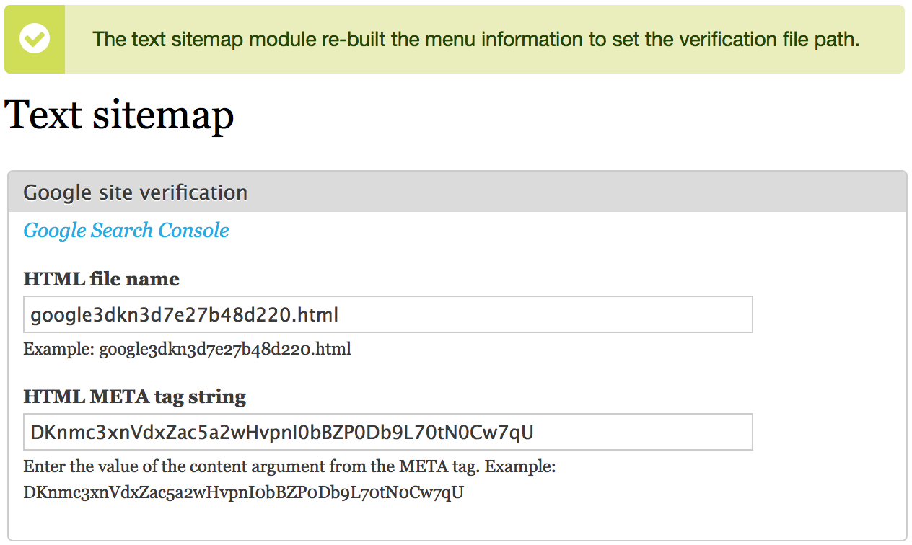

Text sitemap
============

Creates a virtual sitemap.txt file for indexing by search engines.

Text sitemaps are supported by [Google Webmaster Tools](https://support.google.com/webmasters/answer/183668?hl=en) and [Bing](https://www.bing.com/webmaster/help/how-to-submit-sitemaps-82a15bd4).

If you use this module, and want to override listing a specific node, you could use robots.txt to make an exclusion or unpublish it.

Note that the sitemap.txt file is cached so may not reflect new content until after one of Backdrop's routine cache flushes.

Configuration
-------------

The configuration options support verifying through Google Search Console using either or both of the HTML file and HTML tag methods.

Current Maintainer
------------------

- David Norman (https://github.com/deekayen)

Credits
-----------

- Originally written for Drupal by David Norman as URL list
  (https://www.drupal.org/project/urllist)
- Ported to Backdrop by David Norman (https://github.com/deekayen)

License
-------

This project is GPL v2 software. See the LICENSE.txt file in this directory for
complete text.
